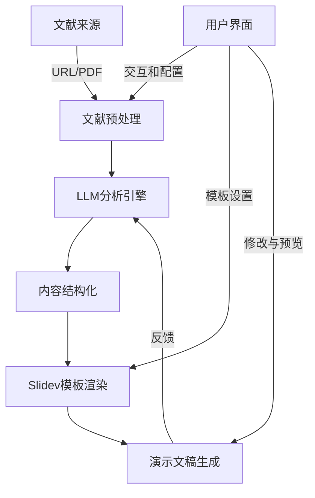
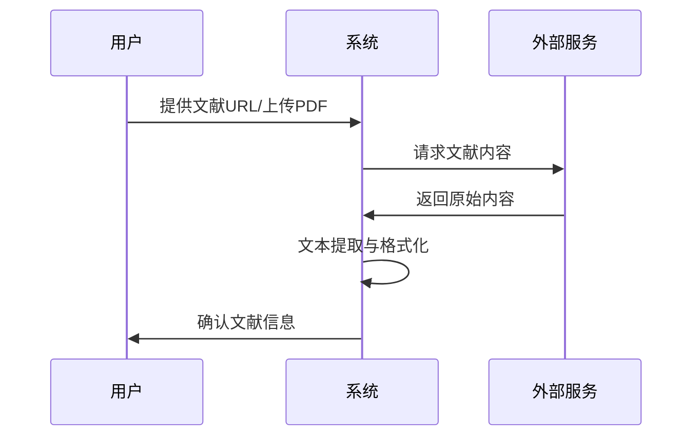
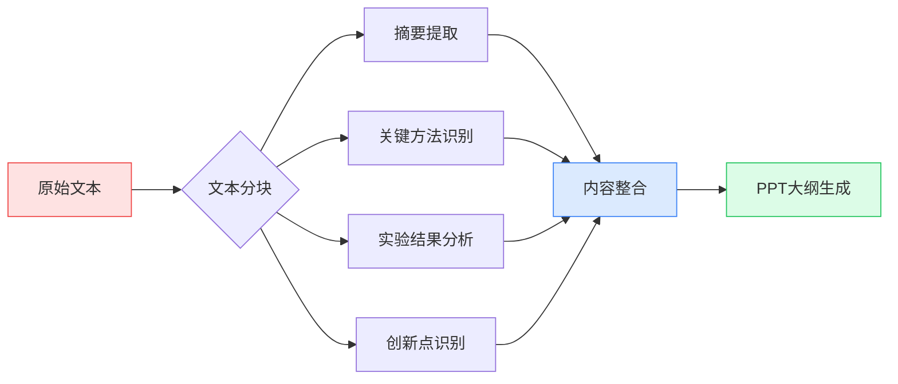
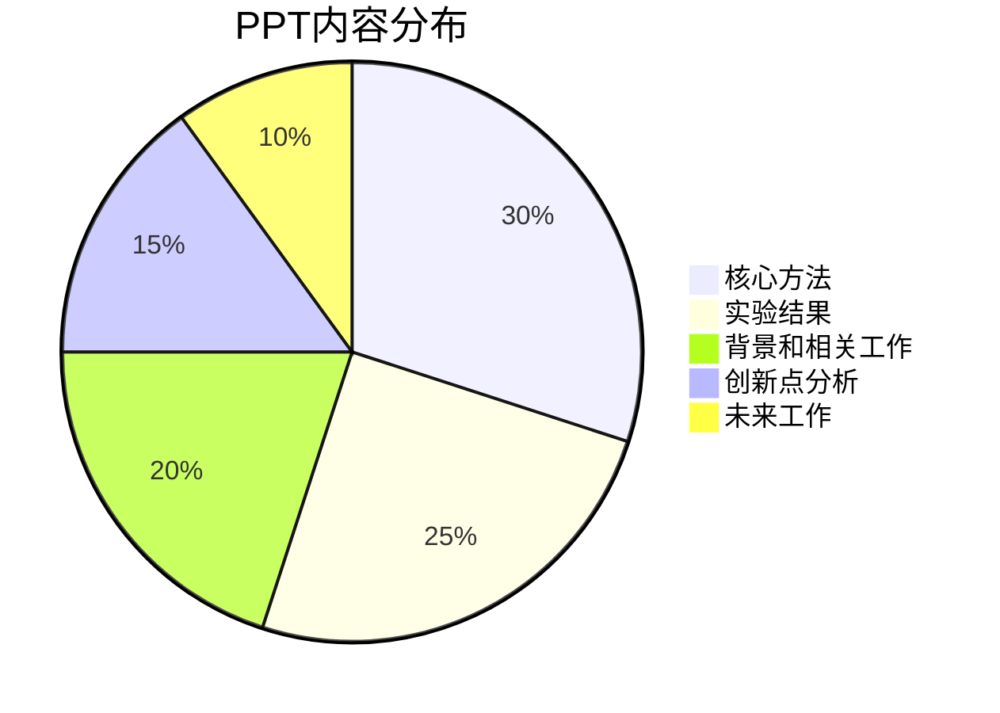

# 组会终结者 🚀

Group Meeting Terminal

## 项目背景 📚

科研人员经常面临着阅读大量文献并在组会中进行汇报的挑战。传统的PPT制作流程耗时且重复性高：

- 阅读文献需要大量时间和精力
- 提取文献的关键信息需要专业知识和经验
- 设计美观且逻辑清晰的PPT需要额外的设计技能
- 整个过程通常需要2-8小时不等

随着大型语言模型(LLM)技术的发展，我们现在有可能自动化这一过程，让研究人员将更多时间专注于更有创造性的工作。

## 项目目标 🎯

- 构建一个端到端的自动化系统，从文献URL到完整演示文稿
- 利用LLM技术提取并分析文献中的关键信息
- 使用Slidev自动生成美观、专业的演示文稿
- 提供用户友好的交互界面，允许用户进行必要的定制和修改
- 减少制作组会PPT的时间从小时级到分钟级

## 系统架构 🏗️

## 技术栈选择 💻

| 组件 | 技术选择 | 原因 |
|------|----------|------|
| 后端服务 | Node.js/Express | 轻量级、异步性能好、生态完善 |
| LLM接口 | OpenAI API/Claude | 强大的文本理解能力和知识面 |
| 前端界面 | Vue.js/React | 响应式UI、组件化开发 |
| 演示文稿 | Slidev | 基于Markdown、程序员友好、美观 |
| 部署方式 | Docker/Vercel | 简化部署流程、良好扩展性 |

## 实现流程 ⚙️

### 1. 文献获取与解析 📄

- 支持多种文献来源:
  - arXiv URL
  - DOI链接
  - PDF直接上传
  - PubMed ID
- 使用PDF解析库提取文本内容
- 识别文献结构(标题、作者、摘要、章节等)

### 2. LLM内容分析 🧠

- 使用大文本切分技术处理长文献
- 设计专门的提示模板引导LLM:
  - 识别文献核心方法和贡献
  - 提取关键图表和数据
  - 总结实验设计和结果
  - 分析论文优缺点
- 使用多轮对话改进分析质量

### 3. 演示文稿生成 📊

- 基于Slidev的Markdown驱动演示文稿
- 提供多种学术风格的模板:
  - 简约型 (适合理论研究)
  - 数据型 (适合实验研究)
  - 比较型 (适合综述文献)
- 自动生成适当的过渡和动画
- 智能插入图表和代码示例

### 4. 用户交互界面 🖥️

- 直观的Web界面，支持一键式操作
- 实时预览和编辑功能
- 演示文稿定制选项:
  - 模板风格选择
  - 内容详细程度调整
  - 重点内容标记
- 支持导出为多种格式 (PDF, PPTX, HTML)

## 项目计划 📅

| 阶段 | 时间 | 主要任务 |
|------|------|----------|
| 原型开发 | 2周 | 基础API集成、核心功能实现 |
| Alpha测试 | 2周 | 内部测试、系统稳定性提升 |
| Beta版本 | 3周 | 用户反馈收集、功能迭代 |
| 正式发布 | 1周 | 文档完善、部署上线 |

## 实施挑战 ⚠️

1. **准确性挑战**: LLM可能误解或遗漏文献中的关键信息
   - 解决方案: 设计专业领域特定的提示工程，多级审核机制

2. **长文本处理**: 学术文献通常很长，超出LLM上下文窗口
   - 解决方案: 实现高效的文本分块和信息整合策略

3. **多媒体内容**: 论文中的公式、图表等难以自动提取
   - 解决方案: 结合OCR和图像描述技术，必要时提示用户手动处理

4. **领域适应性**: 不同研究领域有不同的演示风格要求
   - 解决方案: 开发可扩展的模板系统，支持用户自定义领域特定模板

## 未来展望 🔮

- **多语言支持**: 扩展到英语之外的其他语言论文
- **多模态输入**: 支持视频讲座、在线课程等作为输入源
- **协作功能**: 允许多人同时编辑和评审演示文稿
- **演讲辅助**: 自动生成演讲稿和预期问题的回答
- **研究跟踪**: 整合相关文献，构建知识图谱

## 进度追踪 📈

| 日期 | 完成内容 | 状态 |
|------|---------|------|
| 2025-04-27 | 项目计划制定 | ✅ |
| 2025-05-04 | API集成测试 | 🚧 |
| 2025-05-11 | 基础UI设计 | 📝 |
| 2025-05-18 | 文本处理模块 | 📝 |

---

💡 **参与贡献**: 如果你对这个项目感兴趣，欢迎联系我们一起开发！ 